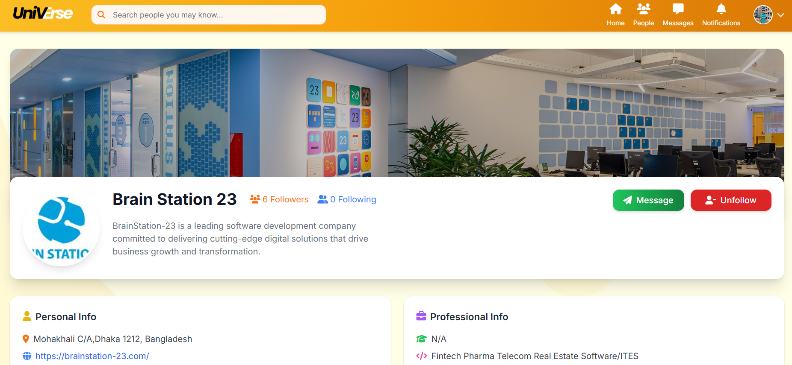

# UniVerse – University Social Networking Platform


> **UniVerse** is a university-focused social networking web application built with **Django** and **Tailwind CSS**.  
> The project demonstrates **real-world backend engineering, secure authentication, optimized performance, and modern UI/UX**, following **industry-standard workflows**.

---

## Table of Contents

1. [Project Overview](#project-overview)
2. [Demo](#-demo)
3. [Features](#features)
4. [Tech Stack](#tech-stack)
5. [Security & Performance](#security--performance)
6. [Setup & Installation](#setup--installation)
7. [Database Configuration](#database-configuration)
8. [Git Workflow](#git-workflow)
9. [Project Structure](#project-structure)
10. [Documentation (SRS & BRD)](#-documentation-srs--brd)
11. [Usage](#usage)
12. [Contribution](#contribution)
13. [License](#license)
14. [Team – UniVerse Developers](#-team--universe-developers)

---

## Project Overview

**UniVerse** is designed to provide a **focused, distraction-free social platform** for university students.

### Goals
- Build a **production-style Django application**
- Apply **security, permission control, and performance optimization**
- Follow **industry-standard development practices**
- Deliver a **clean, modern, and responsive UI**

---

##  Demo Video

**Watch the UniVerse Demo**  
[](demo/video/universe-demo.mp4)

_Click the image to play the demo video_

The demo covers:
- Authentication
- Feed & post interaction
- Profile view
- Reactions & comments
- Messaging & notifications
- Permission-based access

---

## Features

### Authentication & Authorization
- User registration, login, logout
- Password reset (email-based)
- Django authentication system
- CSRF protection for all forms
- Permission checks using Django auth decorators

### 👤 User Profiles (`accounts`)
- Profile picture & bio
- Personal information
- Professional information (education, experience, skills)
- Profile statistics (posts, followers, following)

### 📝 Posts & Feed (`posts`)
- Create, edit, delete posts (text & image)
- Share posts
- Personalized feed (followed users)
- Pagination for scalability

### ❤️ Interactions (`interactions`)
- React to posts (like system)
- Comment on posts
- Optimized queries using `select_related` and `prefetch_related`

### 💬 Messaging (`messaging`)
- One-to-one user messaging
- Conversation-based message handling
- Clean and intuitive chat UI

### 🔔 Notifications (`notifications`)
- Notifications for:
  - Likes
  - Comments
  - Follows
- Implemented using Django signals

### 🎨 UI/UX
- Tailwind CSS for modern styling
- Responsive and mobile-friendly layout
- Improved profile & feed UI
- UI changes without affecting backend logic

---

## 🛠 Tech Stack

| Layer | Technology |
|------|-----------|
| Backend | Django 6.x |
| Frontend | Tailwind CSS, HTML, Django Templates |
| Database | PostgreSQL |
| Language | Python 3.11+ |
| Dev Tools | Git, pip, virtualenv |
| Configuration | `.env` environment variables |

---

## 🔐 Security & Performance

### Security
- CSRF protection enabled on all forms
- Django authentication & authorization
- Login-required access for sensitive actions
- Owner-only permissions for post modification

### Performance
- Pagination for feeds and posts
- Optimized ORM queries
- Reduced N+1 query issues

---

## Setup & Installation

### Clone the Repository
```bash
git clone https://github.com/<your-username>/universe-social-media.git
cd universe-social-media
````

### Create & Activate Virtual Environment

```bash
python -m venv venv
# Windows
venv\Scripts\activate
# macOS / Linux
source venv/bin/activate
```

### Install Dependencies

```bash
pip install -r requirements.txt
```

### Environment Variables

Create a `.env` file in the project root:

```env
DEBUG=True
SECRET_KEY=your-secret-key

DB_NAME=universe_db
DB_USER=postgres
DB_PASSWORD=yourpassword
DB_HOST=localhost
DB_PORT=5432

EMAIL_BACKEND=django.core.mail.backends.console.EmailBackend
DEFAULT_FROM_EMAIL=no-reply@universe.com
```

---

## Database Configuration
Install PostgreSQL/MySQL successfully configure that and create a database like below in that:

```sql
CREATE DATABASE universe_db;
```
After creating the database come back to your project folder terminal, activate the virtual enivornment and run the below command:

```bash
python manage.py migrate
python manage.py createsuperuser
python manage.py runserver
```
To visit the server go to the below link:

 Application URL: [http://127.0.0.1:8000](http://127.0.0.1:8000)

---

## Git Workflow

* **Main Branches**

  * `main` → Stable / production-ready
  * `develop` → Active development

* **Feature Branches**

  * `feature/<feature-name>`

* **Commit Convention**

```text
<module>: short meaningful message
```

Example:

```text
auth: add CSRF-protected login system
feed: implement pagination and optimized queries
ui: improve profile and feed layout
```

---

## Project Structure

```
universe-social-media/
├── accounts/
├── interactions/
├── messaging/
├── notifications/
├── posts/
├── media/
├── static/
├── templates/
├── theme/
├── universe/
│   ├── settings.py
│   ├── urls.py
│   └── wsgi.py
├── demo/
│   └── video/
│       └── universe-demo.mp4
├── docs/
│   ├── BRD_SRS_Universal_Socila_Media.pdf
├── .env
├── manage.py
└── requirements.txt
```

---

## Documentation (SRS & BRD)

📁 **docs/**

* **SRS (Software Requirements Specification)**
  Functional & non-functional requirements

* **BRD (Business Requirements Document)**
  Business objectives, scope, and constraints

These documents reflect **industry-style planning and requirement analysis**.

---

## Usage

* Register and login
* Create, edit, and delete posts
* React and comment on posts
* Follow/unfollow users
* Use messaging system
* Receive notifications
* Edit profile information

---

## Contribution

1. Fork the repository
2. Create a feature branch
3. Commit changes with meaningful messages
4. Open a Pull Request to `develop`
5. Review → merge → release to `main`

---

## License

This project is intended for **learning, demonstration, and portfolio purposes**.

---

## 👨‍💻 Team – UniVerse Developers

Developed by **BAUET students**:

| Name                                                                               | Role       |
| ---------------------------------------------------------------------------------- | ---------- |
| [Md. Mahfuz Hossain](https://www.linkedin.com/in/muhammadmahfuzhossain/)           | Full Stack |
| [Tirtho Saha](https://www.linkedin.com/in/tirtho-saha-612b47265/)                  | Frontend   |
| [Israt Binte Elias](https://www.linkedin.com/in/israt-binte-elias-445a98257/)      | Frontend   |
| [Sabrina Binty Akhtar](https://www.linkedin.com/in/sabrina-binty-akhtar-7617a1264) | Backend    |
| [Mst. Rizoana Khatun](https://www.linkedin.com/in/muhammadmahfuzhossain)           | Backend    |
| [Nafis Shahriar](https://www.linkedin.com/in/nafis-shahriar-774b912a5)             | Backend    |

---
## Project Status

UniVerse is **feature-complete** and actively maintained.  
Future improvements may include real-time communication, advanced notifications, and API support for mobile applications.

---

**If you find this project useful, consider giving it a ⭐ on GitHub.**
